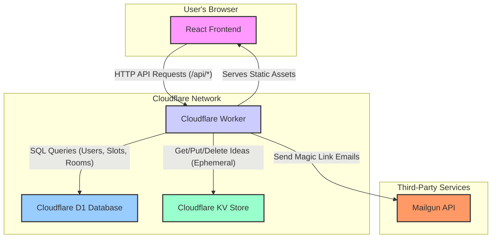

# Open Spaces Live - System Architecture

## High-Level Overview

This document outlines the technical architecture of the **Open Spaces Live** application. The system is designed as a modern, serverless web application deployed entirely on the Cloudflare ecosystem. This provides excellent performance, scalability, and security with a streamlined developer experience.

The core of the application is a single **Cloudflare Worker** that serves both the frontend and the backend API.

-   **Frontend:** A dynamic Single-Page Application (SPA) built with **React** and Vite.
-   **Backend:** A lightweight, performant API built with the **Hono** framework.

## Component Breakdown

### 1. React Frontend

-   **Framework:** React with Vite
-   **Description:** The user interface is a responsive Single-Page Application. It handles all client-side logic, including displaying the idea board, submitting new ideas, voting, and the admin/facilitator dashboard. It communicates with the backend via a RESTful API.

### 2. Cloudflare Worker (Hono Backend)

-   **Framework:** Hono
-   **Description:** The worker is the heart of the application. It's a single JavaScript entry point that runs on Cloudflare's edge network.
    -   It serves the static assets (HTML, CSS, JS) for the React frontend.
    -   It provides a complete REST API (under the `/api/` route) for all backend logic, including authentication, database operations, and idea management.

### 3. Cloudflare D1 Database

-   **Description:** D1 is a serverless SQL database. It is used to store all **persistent, relational data**.
    -   `users`: Stores information about admin and facilitator accounts.
    -   `slots`: Stores the time slots for the conference schedule.
    -   `rooms`: Stores the rooms or tracks for the sessions.

### 4. Cloudflare KV Store

-   **Description:** KV is a global, low-latency key-value data store. It is used for **ephemeral or non-relational data**.
    -   **Ideas:** Session ideas submitted by participants are stored here with a 24-hour Time-To-Live (TTL), after which they automatically expire.
    -   **Auth Tokens:** Magic link and session tokens are temporarily stored in KV.

### 5. Mailgun API

-   **Description:** A third-party service used for sending transactional emails.
    -   It is responsible for delivering the magic links for facilitator and admin authentication.
    -   API credentials are securely stored using Wrangler secrets.

## Data & Logic Flow

1.  **Initial Load:** The user's browser requests the site. The Cloudflare Worker intercepts the request and serves the static `index.html` and associated React assets.
2.  **Idea Submission:** A participant submits an idea. The React frontend sends a `POST` request to `/api/ideas`. The worker receives this, generates a new idea object, and stores it in the **KV Store**.
3.  **Admin/Facilitator Login:** A facilitator requests a magic link. The frontend sends a `POST` request to `/api/auth/login`. The worker generates a unique token, stores it in **KV**, and uses the **Mailgun API** to email the link to the user.
4.  **Dashboard Management:** A logged-in facilitator creates a new time slot. The React dashboard sends a `POST` request to `/api/slots`. The worker validates the request and inserts the new slot into the **D1 Database**.
5.  **Session Assignment:** The facilitator assigns an idea to a slot. The dashboard sends a `POST` request to `/api/ideas/:id/assign`. The worker updates the idea's record in the **KV Store** with the slot and room IDs.
