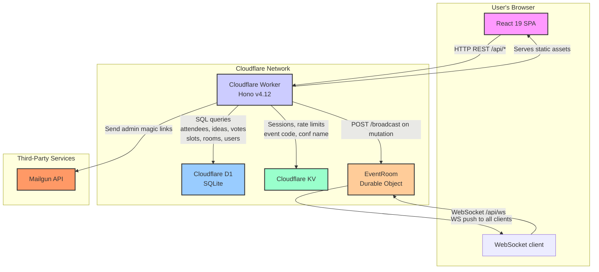

# Open Spaces Live — System Architecture

## High-Level Overview

Open Spaces Live is a serverless web application deployed entirely on the Cloudflare ecosystem. A single **Cloudflare Worker** serves both the static frontend assets and the REST + WebSocket API.

**Design principle: D1 is the source of truth. The Durable Object is a pubsub fanout only — it holds no state.** If the DO restarts, connected clients automatically reconnect and re-fetch state from REST. There is no write-through cache and no consistency puzzle.

```text
Browser ──HTTPS──▶ Cloudflare Worker (Hono v4.12)
                    │
                    ├─ HTTP REST  ──▶ D1 (source of truth)
                    │                  ├ attendees, ideas, votes
                    │                  └ rooms, slots, users
                    │
                    ├─ KV         ──▶ Sessions, rate-limit counters,
                    │                  event code, conference name
                    │
                    └─ WS upgrade ──▶ EventRoom Durable Object
                                       (hibernatable WS fanout — no state)

Browser ◀─WS push── EventRoom DO  ◀── Worker POSTs to DO /broadcast
                                        on every mutation
```

## Component Breakdown


```mermaid
graph TD
    subgraph "User's Browser"
        A[React 19 SPA]
        WS[WebSocket client]
    end

    subgraph "Cloudflare Network"
        B[Cloudflare Worker<br/>Hono v4.12]
        C[Cloudflare D1<br/>SQLite]
        D[Cloudflare KV]
        DO[EventRoom<br/>Durable Object]
    end

    subgraph "Third-Party Services"
        E[Mailgun API]
    end

    A -- "HTTP REST /api/*" --> B
    WS -- "WebSocket /api/ws" --> DO
    B -- "Serves static assets" --> A
    B -- "SQL queries<br/>attendees, ideas, votes<br/>slots, rooms, users" --> C
    B -- "Sessions, rate limits<br/>event code, conf name" --> D
    B -- "POST /broadcast on mutation" --> DO
    DO -- "WS push to all clients" --> WS
    B -- "Send admin magic links" --> E

    style A fill:#f9f,stroke:#333,stroke-width:2px
    style B fill:#ccf,stroke:#333,stroke-width:2px
    style C fill:#9cf,stroke:#333,stroke-width:2px
    style D fill:#9fc,stroke:#333,stroke-width:2px
    style DO fill:#fc9,stroke:#333,stroke-width:2px
    style E fill:#f96,stroke:#333,stroke-width:2px
```

## Component Details

### 1. React Frontend (SPA)

- **Framework:** React 19 + Vite 8. React Router v7 for client-side routing.
- **State:** Zustand v5 store (`src/lib/store.js`) is the single source of truth on the client. Both REST responses and WebSocket delta events update the same store. Components subscribe via selectors.
- **Drag-and-drop:** `@dnd-kit/core` v6 powers the Schedule Builder grid.
- **Routes:**
  - `/` — Marketplace: submit ideas, vote, live updates
  - `/schedule` — read-only schedule grid
  - `/projector` — big-screen projection view (auto-rotating, WS-subscribed)
  - `/dashboard` — facilitator/admin: Ideas, Schedule Builder, Admin tabs
  - `/login-code` — facilitator event-code entry
  - `/admin-login` — admin magic-link request
  - `/verify-login` — admin magic-link callback

### 2. Cloudflare Worker (Hono Backend)

- **Framework:** Hono v4.12
- **Entry point:** `worker/index.js` — mounts route modules, exports `EventRoom` DO class for Wrangler discovery.
- **Middleware** (`worker/middleware.js`):
  - `bindings()` — exposes D1/KV on Hono context
  - `attendee()` — resolves or issues the `os_attendee` HMAC-signed cookie; inserts a new attendee row on first visit
  - `session()` — reads admin and facilitator session cookies from KV; sets `role` on context
  - `requireFacilitator` / `requireAdmin` — role guards
- **Route modules:** `attendees`, `ideas`, `auth`, `admin`, `schedule`, `ws`

### 3. Cloudflare D1 (Source of Truth)

D1 is a serverless SQLite database. All persistent business data lives here.

| Table | Purpose |
|---|---|
| `attendees` | One row per browser (anonymous). Keyed by HMAC-cookie ID. |
| `ideas` | Session proposals. Includes `vote_count` (denormalized), `slot_id`, `room_id`, `status`, `merged_into_id`. |
| `votes` | Junction table — PRIMARY KEY `(idea_id, attendee_id)`. Enforces one vote per attendee per idea at the DB level. |
| `slots` | Time rows for the schedule grid (`start_time`, `duration_minutes`, `position`). |
| `rooms` | Column headers for the schedule grid (`name`, `position`). |
| `users` | Admin user accounts for magic-link authentication. |

**Vote integrity:** `INSERT OR IGNORE INTO votes` + `UPDATE ideas SET vote_count = vote_count + 1`. Atomic — no read-modify-write race condition possible.

**Cell uniqueness:** A `UNIQUE INDEX ON ideas(slot_id, room_id)` prevents two ideas from being assigned to the same schedule cell. The assign route catches the resulting constraint error and returns 409.

### 4. Cloudflare KV

KV is used only for session-scoped and event-scoped data. Ideas and votes are stored in D1.

| Key pattern | Value | TTL |
|---|---|---|
| `session:{id}` | `{email, role, user_id}` JSON | 24 h |
| `facilitator_session:{id}` | `{role, created_at}` JSON | 12 h |
| `token:{id}` | `{email, role, user_id}` JSON | 15 min |
| `event_code` | `{code, expires_at}` JSON | configurable |
| `conference_name` | string | none |
| `rl:{action}:{key}:{window}:{bucket}` | integer count | window duration |

### 5. EventRoom Durable Object

`worker/durable-objects/EventRoom.js` — a singleton DO (fixed name `"main"`) that manages WebSocket connections and fans out broadcast events.

- Uses the **hibernatable WebSocket** pattern (`this.state.acceptWebSocket()`). The DO is billed only when actively handling messages — near-zero cost at 50–150 attendees.
- `/connect` — upgrades an incoming request to a hibernatable WebSocket
- `/broadcast` — accepts a POST with a JSON event body; sends it to every connected socket

The Worker calls `broadcast(env, event)` (`worker/lib/broadcast.js`) after every mutation. This helper POSTs to the DO's `/broadcast` endpoint. Failure is swallowed — the REST response is still authoritative.

**WebSocket event types:**

```text
idea:added         idea:updated       idea:assigned      idea:merged
idea:removed       slot:changed       slot:removed
room:changed       room:removed
conference:renamed conference:votes_reset conference:reset
pong
```

### 6. Mailgun API

Used only for admin authentication. Facilitators no longer receive emails.

- `POST /api/auth/login` — admin requests a magic link; Worker sends it via Mailgun
- `GET /api/auth/verify` — admin clicks link; Worker deletes the one-time token and issues a 24 h session cookie
- Admin invitation emails when a new admin account is created from the AdminPanel

## Auth Model

| Principal | How they authenticate | Session storage | Duration |
|---|---|---|---|
| Attendee | Automatic — HMAC cookie issued on first request | D1 `attendees` row | 30 days |
| Facilitator | Pre-shared event code at `/login-code` | KV `facilitator_session:{id}` | 12 hours |
| Admin | Mailgun magic-link | KV `session:{id}` | 24 hours |

`requireFacilitator` accepts either facilitator or admin role. `requireAdmin` accepts admin only.

## Rate Limiting

`worker/lib/rateLimit.js` implements a KV-backed sliding-window counter. Key shape: `rl:{action}:{key}:{window}:{bucket}`.

| Action | Limit |
|---|---|
| Vote (cast or remove) | 30 per minute + 200 per hour per `attendee_id` |
| Idea submission | 5 per 10 minutes + 15 per hour per `attendee_id` |
| Facilitator code attempts | 5 per minute + 30 per hour per IP |
| Admin login attempts | 5 per minute per IP |

## Data & Logic Flow

### Initial page load

1.  Browser requests any page. Worker serves the React SPA (`index.html` + assets).
2.  React mounts, calls `store.bootstrap()`: parallel fetches to `/api/auth/me`, `/api/ideas`, `/api/schedule`.
3.  After bootstrap completes, React connects to `/api/ws` → Worker proxies the upgrade to the DO → hibernatable WebSocket established.

### Idea submission

1.  Participant submits a title. Frontend sends `POST /api/ideas`.
2.  Worker validates rate limit, inserts into D1 `ideas`, then calls `broadcast(env, {type: 'idea:added', idea})`.
3.  DO sends the event to all connected sockets. Every open browser adds the new card to its Zustand store without a refresh.

### Voting

1.  Participant clicks vote. Frontend sends `POST /api/ideas/:id/vote`.
2.  Worker: `INSERT OR IGNORE INTO votes` — if `changes = 0`, the attendee already voted (returns idempotently).
3.  If inserted: `UPDATE ideas SET vote_count = vote_count + 1`. Then broadcast `idea:updated`.
4.  Client optimistically updates vote count; rolls back on error.

### Schedule assignment

1.  Facilitator drags an idea card onto a grid cell. Frontend sends `POST /api/ideas/:id/assign` with `{slot_id, room_id}`.
2.  Worker runs `UPDATE ideas SET slot_id = ?, room_id = ?`. If the cell is occupied, D1 throws a UNIQUE constraint error → Worker returns 409.
3.  On success: broadcast `idea:assigned`. All clients update their schedule view live.

### Facilitator login

1.  Facilitator enters the event code at `/login-code`. Frontend sends `POST /api/auth/facilitator-code`.
2.  Worker checks the code against `event_code` in KV. On match: creates a `facilitator_session:{id}` KV entry (12 h TTL) and sets the `os_facilitator` cookie.

### Admin login

1.  Admin enters email at `/admin-login`. Frontend sends `POST /api/auth/login`.
2.  Worker looks up the user in D1. Only sends a Mailgun magic-link if `role = 'admin'` (anti-enumeration: always returns success).
3.  Admin clicks the link (`/verify-login?token=…`). Worker deletes the one-time token, creates a 24 h `session:{id}` KV entry, sets the `session_id` cookie.

## Free Tier Footprint

| Resource | Estimated usage | Free tier limit |
|---|---|---|
| D1 writes | ~4.5 k per event (150 attendees × 30 votes) | 5 M / month |
| KV writes | ~10 per attendee/hour (rate-limit counters only) | 1 k / day |
| Worker requests | ~30 k per event | 100 k / day |
| DO activity | ~thousands of WS messages per event; hibernatable | effectively free |
